# Taller APIs ✨👩‍🎤💻

## Nombre del estudiante
- Camilo Andrés Medina Sánchez
- 🏫 Universidad Nacional De Colombia 🏫
- 💻Ingeniería de sistemas y computación💻

## Fecha de entrega
`2026-04-24`

### Objetivo del taller
El objetivo de este taller es desarrollar una práctica haciendo uso de postman con el fin de afianzar los conocimientos adquiridos en clase sobre APIs, así como también aprender a realizar peticiones HTTP y manejar respuestas de manera efectiva.
Se pretende separar dos casos principales, el primero haciendo uso de Rest y en el segundo caso haciendo uso de GraphQL, para así poder comparar ambos enfoques y entender sus diferencias y ventajas.

### Primera parte del taller: Rest API 

Para la primera parte del taller, se debe elegir una API de la lista y en postman realizar las siguientes peticiones:
 - Get: Obtener todos los recursos disponibles en la API.
 - Get: uno por Id o filtros
 - Si hay la posibilidad de desarrollar una solicitud POST, realizarla para crear un nuevo recurso.
 - Usar query parameters en al menos un request.

Además, se debe exportar la colección en un formato JSON.
Es importante mostrar evidencias fotográficas de las peticiones realizadas, incluyendo los resultados obtenidos, para demostrar el correcto funcionamiento de las solicitudes.
Además, se debe incluir información relacionada con autenticación, si esta existe, códigos de estado HTTP, y cualquier otro detalle relevante que pueda ayudar a comprender el proceso de interacción con la API.

#### Primera ejecución de la API

Teniendo en cuenta la API que fue proveida por el profesor, se ejecuta en postman el primer request para ver el funcionamiento de este, $https://api.thedogapi.com/v1$
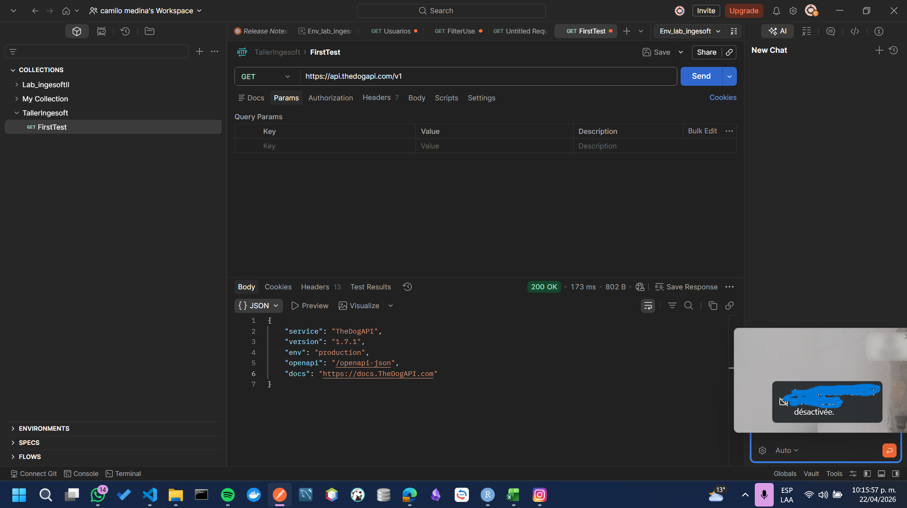
Como se evidencia en la imagen previa, el endpoint es válido. Por tanto, es posible proseguir con la práctica. 

Una de las preguntas que se debe resolver en el taller, es el por qué de la elección de esa API, la respuesta es muy sencilla, porque son perritos 🐶🥰.

Ahora bien, una de las prácticas importantes y más aceptadas en el entorno es la definición de un base url, que indica el punto común que tiene la url al inicio con el fin de tener un acceso más sencillo por medio de una variable.

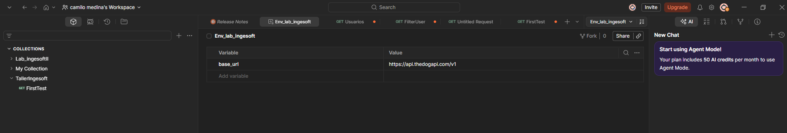

En un ambiente, se indica el base_url que será una variable en común. Más adelante, se va a usar este mismo ambiente para el uso de una API key

#### Obtención de una API key para requests.

Cuando se intentó llamar al endpoint $https://api.thedogapi.com/v1/breeds$ con un método get, ocurrió el siguiente error

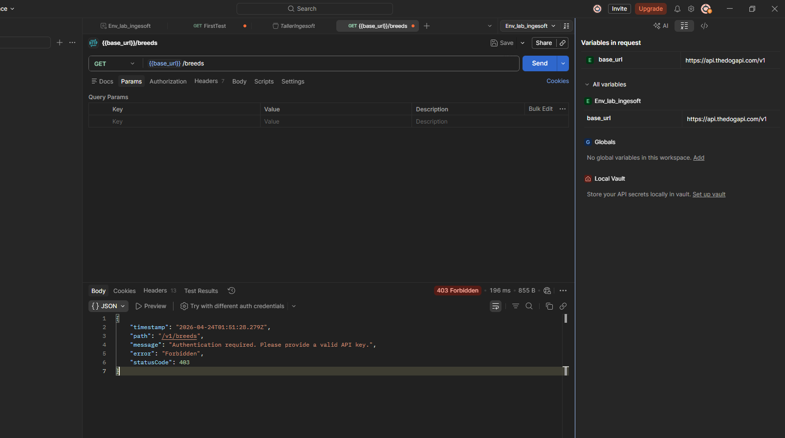

Como se ve en la imagen, al intentar obtener la lista completa de las razas (breeds, en inglés), ocurre un error con código de estado (statusCode: 403 Forbidden) Donde se indica Authentication required: Please provide a valid API key. Es decir, error de autenticación, por favor indica la API key.

Después de leer la documentación de la API, se descubre el proceso adecuado para la obtención de la API key. A continuación, se encuentran las imagenes de este proceso.

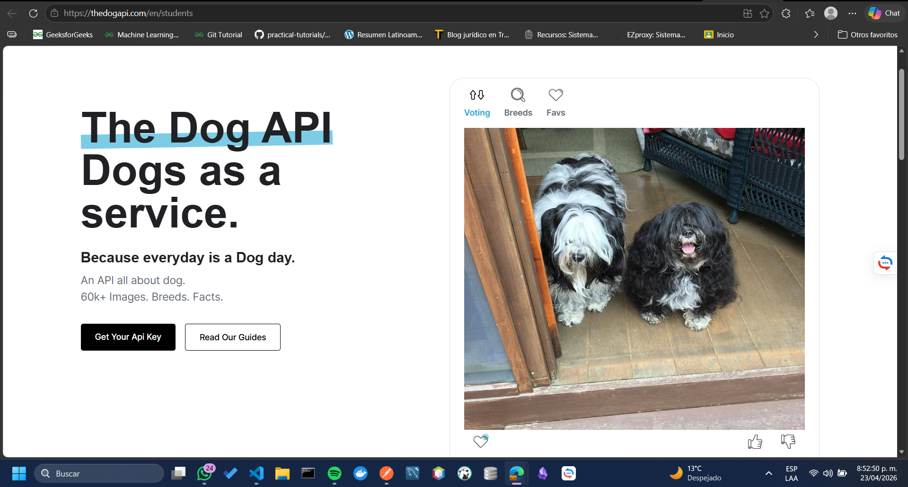
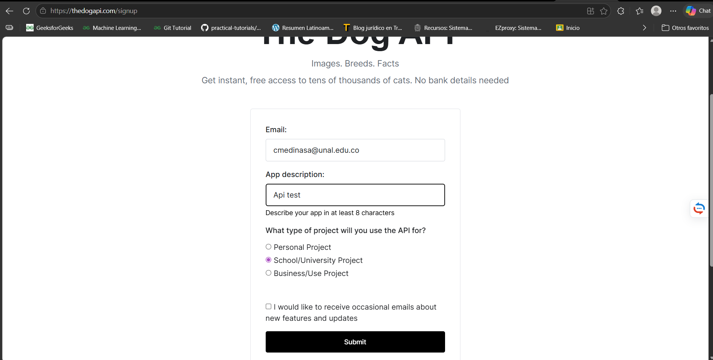
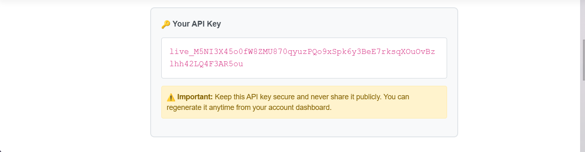

Al llenar el formulario de solicitud, al correo electrónico llega la API key. Ahora bien, como se indicó más arriba, la api key se guarda en el environment para permitirla ser utilizada en todas las solicitudes poosteriores. A continuación, se muestra la imagen que indica la inclusión de la API key. 

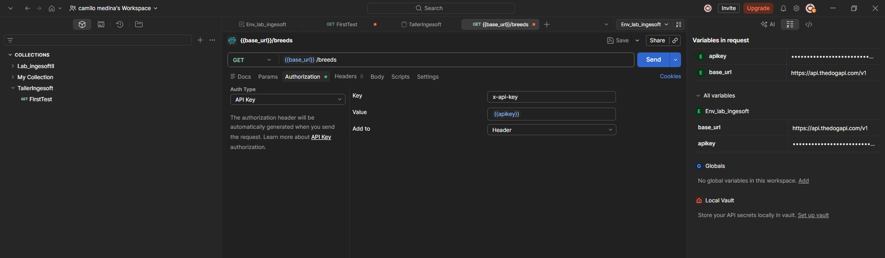

#### Solicitud general 

Con la API key, se vuelve a solicitar el json completo de las razas, el cual devuelve en formato json, información de la forma.

```json
{
    "id": "1",
    "name": "Affenpinscher",
    "species_id": "2",
    "life_span": "12-15",
    "temperament": "Confident, alert, playful, loyal, courageous",
    "origin": "Germany",
    "country_codes": "DE",
    "country_code": "DE",
    "description": "Small, sturdy toy breed with a distinctive monkey-like expression and shaggy, wiry coat. Known for its confident, terrier-like personality despite its small size.",
    "bred_for": null,
    "perfect_for": null,
    "breed_group": "Toy",
    "history": "Originating in 17th-century Germany, bred down from larger terriers to be skilled ratters in homes, kitchens and stables. Refined in Munich and Berlin, recognized by AKC in 1936. Name translates to 'monkey-like terrier'.",
    "reference_image_id": "uaRTIWL69C",
    "weight": {
        "imperial": "7-10",
        "metric": "3.2-4.5"
    },
    "height": {
        "imperial": "9-11.5",
        "metric": "23-29"
    },
    "image": {
        "id": "uaRTIWL69C",
        "url": "https://storage.googleapis.com/dog-api-uploads-prod/originals/8009d9ca-3f02-41dc-89fd-c9241027fb96.jpeg",
        "width": 1184,
        "height": 912
    }
}

```

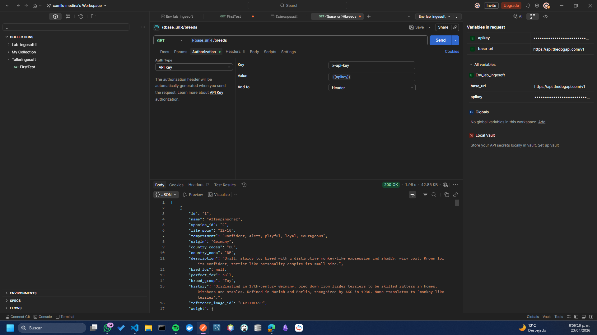

Como se logra ver, luego de la inclusión de la API key en el environment, es posible el desarrollo de solicitudes

#### Filtrado

Ahora bien, no siempre es necesario en un api obtener toda la información, es por ello que se pueden desarrollar filtrados, en este caso, para filtrar por raza poodle se hace una solicitud get al endpoint: ${{baseurl}}/breeds/search?q=poodle$

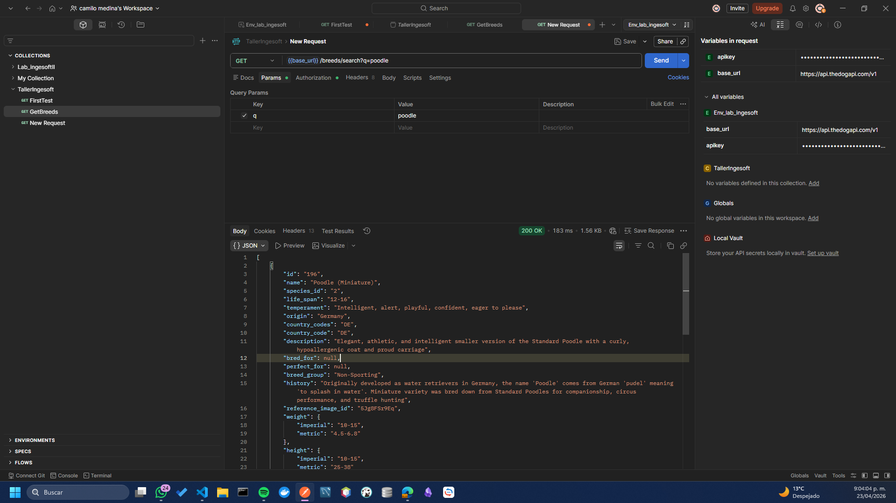

```json
[
    {
        "id": "196",
        "name": "Poodle (Miniature)",
        "species_id": "2",
        "life_span": "12-16",
        "temperament": "Intelligent, alert, playful, confident, eager to please",
        "origin": "Germany",
        "country_codes": "DE",
        "country_code": "DE",
        "description": "Elegant, athletic, and intelligent smaller version of the Standard Poodle with a curly, hypoallergenic coat and proud carriage",
        "bred_for": null,
        "perfect_for": null,
        "breed_group": "Non-Sporting",
        "history": "Originally developed as water retrievers in Germany, the name 'Poodle' comes from German 'pudel' meaning 'to splash in water'. Miniature variety was bred down from Standard Poodles for companionship, circus performance, and truffle hunting",
        "reference_image_id": "5Jg8FSr9Eq",
        "weight": {
            "imperial": "10-15",
            "metric": "4.5-6.8"
        },
        "height": {
            "imperial": "10-15",
            "metric": "25-38"
        },
        "image": {
            "id": "5Jg8FSr9Eq",
            "url": "https://storage.googleapis.com/dog-api-uploads-prod/originals/26157129-e8cc-44a1-bbb1-cec578a5f3d7.png",
            "width": 2968,
            "height": 2272
        }
    },
    {
        "id": "197",
        "name": "Poodle (Toy)",
        "species_id": "2",
        "life_span": "10-18",
        "temperament": "Intelligent, alert, confident, playful, affectionate, loyal, outgoing",
        "origin": "Germany",
        "country_codes": "DE",
        "country_code": "DE",
        "description": "Smallest Poodle variety with dense curly hypoallergenic coat and alert, intelligent demeanor. An elegant, proud companion dog known for exceptional trainability and performing ability.",
        "bred_for": null,
        "perfect_for": null,
        "breed_group": "Toy",
        "history": "Despite association with France the Poodle originated in Germany as water retrieving dog from German pudel meaning to splash in water. The Toy variety was bred down from Standard and Miniature Poodles for urban companionship and prized by aristocracy for intelligence and performing ability. AKC recognition 1887.",
        "reference_image_id": "fEv1nEVsy6",
        "weight": {
            "imperial": "4-6",
            "metric": "1.8-2.7"
        },
        "height": {
            "imperial": "8-10",
            "metric": "20-25"
        },
        "image": {
            "id": "fEv1nEVsy6",
            "url": "https://storage.googleapis.com/dog-api-uploads-prod/originals/be1783c6-87c7-49bb-80b4-781e91374766.png",
            "width": 2898,
            "height": 2272
        }
    }
]
```

Para esta solicitud, el filtrado se devuelve como una lista de diccionarios (En el lenguaje netamente pythonista). En vez de un objeto par clave-valor tradicional del json. 

#### Obtención de imágenes aleatorias

Otro de los servicios que nos ofrece la API es la obtención de imagenes aleatorias, para ello, se desarrolla un llamado al endpoint: ${{baseurl}}/images/search$. De manera que cada vez que se hace un nuevo llamado se genera una imagen aleatoria diferente. 

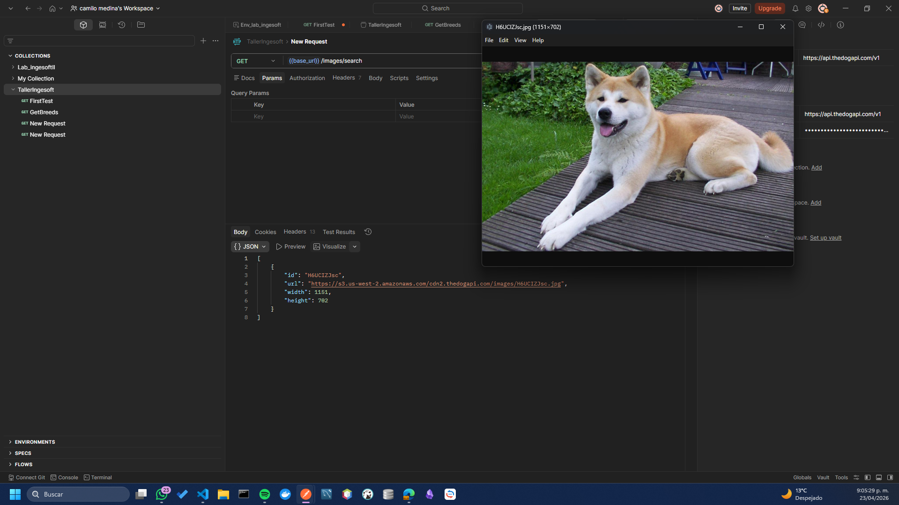
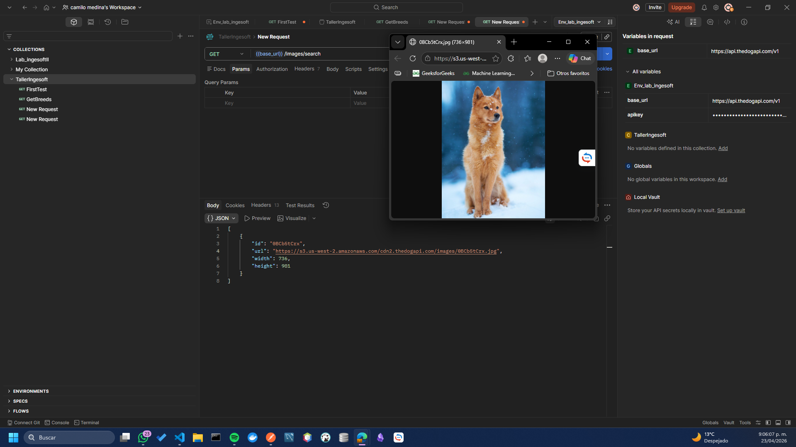

Como se ven en las imagenescada vez que se hace el llamado al endpoint se obtiene una imagen diferente. 

Notese, que la URL proporcionada de cada imagen tiene un s3, que a pesar de no ser relevante para el ejercicio que se está desarrollando sirve como conocimiento general. Un bucket de s3 es un servicio de Amazon Web Services (AWS), este es un contenedor para almacenare archivos o imágenes de forma segura y escvalable en la nube. 

#### Generación de tests

Los test son una herramienta fundamental en el desarrollo de software, al permitirnos evaluar si los procesos que se están desarrollando funcionan de manera adecuada. Estos test se desarrollan en el lenguaje de programación javascript (js).

El primer test que se plantea busca usar el base url y verificar que este funcionando. Es decir, debe devolver un código de estado 200 al ejecutar send.
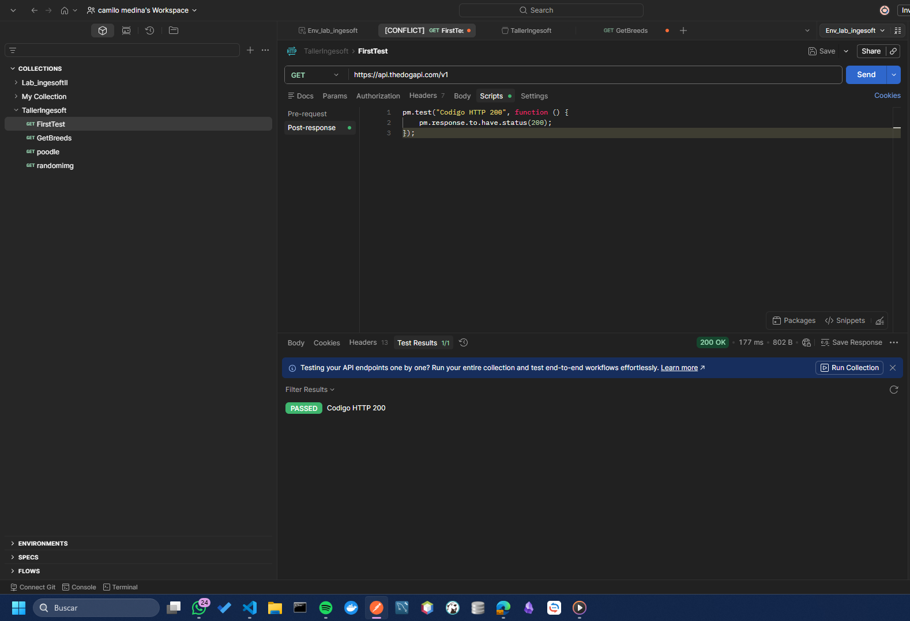

El segundo test que se plantea, busca ver que la estructura del json sea valida, al menos en las llaves primarias y valores obligatorias y que la respuesta no sea vacia. Este test se plantea sobre el endpoint que genera la lista de todas las razas de perros que hay dispnibles. 

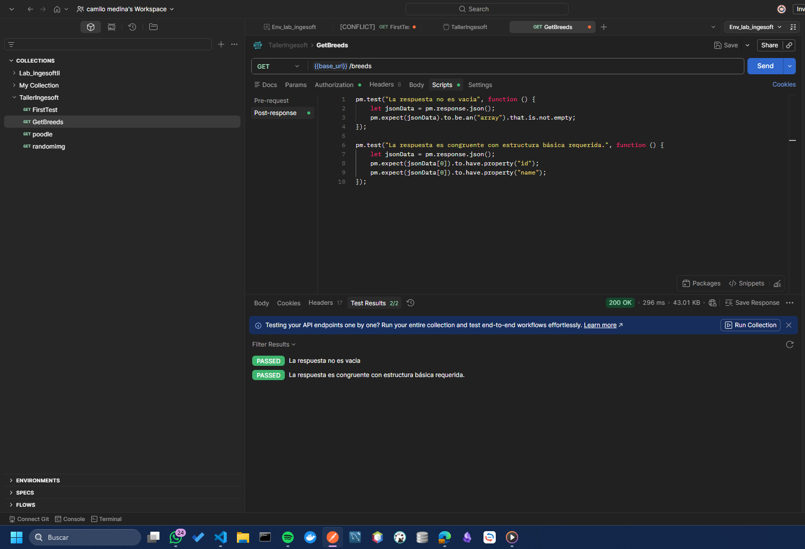


#### Resumen de la primera parte


### Segunda parte del taller: GraphQL API

#### Resumen de la segunda parte


