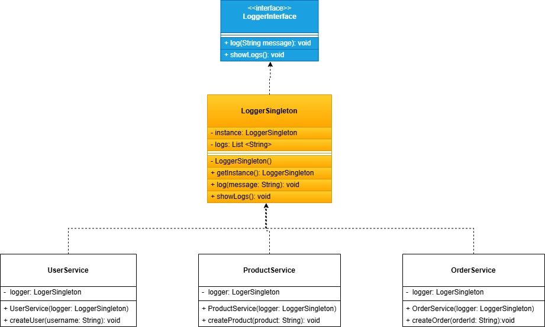
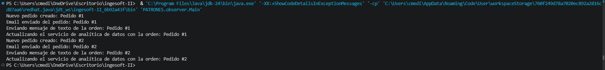

# Taller Patrones de diseño de software ✨👩‍🎤

## Nombre del estudiante
- Camilo Andrés Medina Sánchez
- 🏫 Universidad Nacional De Colombia 🏫
- 💻Ingeniería de sistemas y computación💻

## Fecha de entrega
`2026-05-09`

### Patrones de diseño creacionales

Estos patrones buscan facilitala creación de objetos predefiniendo su lógica y encapsulandola, con el fin de hacer el sistema más flexible y desacoplado. 
Un ejemplo muy general, podria ser en un restaurante cuando se pide un plato y no se conoce el proceso de trás de la **creación del plato** solo se conoce el resultado.

#### Patrón de diseño singleton

El patrón de diseño singleton busca la creación de una clase global y una sola instancia de ella proponienco un punto de acceso global para que esta pueda ser utilizada, este patrón de diseño puede estar muy estrechamente relacionado con el proceso de inyección de dependencias y por tanto, tendrá una relación muy fuerte con el principio de dependency inversion (DIP) de solid.
En esta sección se mostrará la implementación del patrón singleton y a su vez como este puede ser relacionado con el quinto principio solid. 

Un ejemplo de la vida real del patrón singleton es el gobierno de un país, teniendo en cuenta que solo puede existir un gobierno.

Usualmente, este patrón es ampliamente utilizado para definir parámetros de configuración que se deben compartir durante todo el flujo de ejecución, por ejemplo, una conexión a base de datos. Para este ejemplo particular, se va a programar un sistema de logs basado en una lista.

[Clase principal singleton.](./singleton/LoggerSingleton.java)


Notese la arquitectura o diseño inicial de la clase singleton, el constructor está privado. Por tanto, no se pueden hacer llamados a la creación de objetos por fuera de la misma clase. Es decir, esto está prohibido: 
```java
LoggerSingleton log1 = new LoggerSingleton();
LoggerSingleton log2 = new LoggerSingleton();
```
Además que se crea una variable instance dentro de la clase singleton la cual es estática, es decir, se comparte en todas las instancias de la clase (A pesar de que solo se tendrá una).
```java
public static synchronized LoggerSingleton getInstance() {
    if (instance == null) {
        instance = new LoggerSingleton();
    }
    return instance;
}
```
Por otro lado, tengase en cuenta la funcion getInstance, esta es una función crucial.
En primera medida, notese que es una función synchronized, esto teniendo en cuenta que si se hace multithreading en java, mientras se está en un hilo puede ser que la instancia no exista y al pasar a otro se cree la instancia y regresando se cree de nuevo. Resultando con dos instancias (A pesar de que suena confuso).


La imagen describe la situación presentada. 
Comenzando en el segundo hilo se ve que singleton está en null.
Se cambia al hilo 1 y se ve que singleton está en null, entonces, se instancia la clase.
Se cambia de nuevo al hilo 2 y como singleton estaba en null se instancia.
Resultado del proceso, hay dos instancias de la clase singleton.

En terminos generales, la función getInstance, verifica si existe una instancia de la clase, si no hay, la crea. Por el contrario, si ya existe la devuelve. 

La recopilación de estas medidas permiten lo siguiente: 
```java
LoggerSingleton log1 = new LoggerSingleton();
LoggerSingleton log2 = new LoggerSingleton();
System.out.println(log1 == log2); // true
```
Notese que solo es posible la creación de una instancia de clase.

Ahora bien, a continuación se muestra el diagrama UML de como queda la implemenatación que se plantea en esta práctica.
A grosso modo, se pretende generar una clase singleton que maneje los logs dentro de todo el sistema.



Las clases de serivicio de creación de usuarios, productos y ordenes usan la clase singleton Logger. 
Notese que se desarrolla una inyección de dependencias pues los constructores de estas tres clases de servicio reciben como parámetro una instancia de la clase singleton.

#### Patrón de diseño builder

El patrón de diseño builder permite simplificar la creación de objetos complejos.
Por ejemplo, el proceso de creación de una factura puede llegar a tener los siguientes campos hipotéticos.
- número
- cliente
- fecha
- subtotal
- impuestos
- descuento
- observaciones
- método de pago
Teniendo en cuenta esto, el constructor de esta clase se vería de esta forma: 
```java
class Factura{
    public Factura(
        int numero,
        String cliente,
        String fecha,
        int subtotal,
        int impuestos,
        int descuento,
        String observaciones,
        String metodo_pago
    ){
        // ...
    }
}
```
Esto termina siendo un proceso muy tedioso y el constructor se ve muy lleno, este es el principal problema que es resuelto con el patrón builder.

Ahora bien, ¿Cómo se ve la clase luego de aplicar el patrón de diseño?

[Visualización de la clase factura aplicando el método builder](./builder/Factura.java)

Como se ve en el hipervinculo indicado acá arriba. El constructor recibe una instancia de builder.
Se declaran todos los atributos de Factura como atributos privados y se indica en el constructor que estos dependen de builder.
Ahora bien, la clase Builder es una clase que está dentro de la misma clase Factura, esto no es estrictamente necesario, pero suele desarrollarse así porque el builder solo pertenece a esa clase.
El builder tiene una colección tan grande de setters como de atributos de la clase base.


### Combinación del patrón singleton con el patrón observer

#### Patrón observer 

El patron observador permite que un objeto notifique de manera automática a otros objetos cuando ocurre un cambio en su estado.
En términos generales funciona como un servicio de suscripción. Por ejemplo, a un boletin de noticias o a un periodico, de forma que de manera automática el usuario recibe las actualizaciones de los cambios que se han generado o cuando se emite un nuevo boletín.

Esto nos permite afirmar que los patrones de comportamiento no solo describen estructuras de relaciones entre clases, sino que también establecen mecanismo de comunicación entre cad auna de las clases.

Uno de los principales usos de este patrón es en el desarrollo de interfaces gráficas, que permiten una interfaz (intermediario de comunicación) entre el usuario y las funcionalidades de software que se han planteado. 

**Ejemplo de aplicación del patrón observer**

Para el ejemplo de aplicación se pretende la creación de un sistema de notificación de pedidos, algo similar a lo que se estableció previemente. 
Como primera medida, se establece la estructura común de cada uno de los notificadores, esto por medio de una interfaz.

[Interfaz del observador implementada en el lenguaje JAVA](./observer/ObserverInterface.java)
```java
public interface ObserverInterface {
    void update(String order);
}
```

Se procede a la generación de cada uno de los notificadores, para este ejemplo se van a tener tres notificadores: 
- [Email:](./observer/EmailService.java)
- [SMS](./observer/SMSService.java)
- [Análitica](./observer/AnalyticsService.java)

Solo se va a mostrar la funcionalidad esperada, no se va a implementar un módulo completo de envío de correos por SMTP, pues se sale de los objetivos de la práctica.
Como es de esperar cada una de estas clases está mediada por la interfaz que se mostró previamente.

Por otro lado, se crea la interfaz que media la gestión de los suscriptores
[Interfaz SubjectInterface](./observer/SubjectInterface.java)
```java
public interface SubjectInterface {
    void addObserver(ObserverInterface observer);

    void removeObserver(ObserverInterface observer);

    void notifyObservers();
}
```
Como se puede ver, se generan lkos métodos necesarios para añadir suscriptores, eliminar suscriptores y el método de notificación a todos los suscripotores que estén inscritos. COn la estructura básica que se da en la interfaz, se implementa cada uno de los métodos en la [Clase OrderManager](./observer/OrderManager.java).

Dentro de esta clase se crea un arraylist que permite guardar los suscriptores y se implementan cada uno de los métodos descritos por la interfaz mostrada.
El método notifyObservers funciona por medio de un foreach.

Ahora, la clase principal:
```java
public class Main {
    public static void main(String[] args){
        OrderManager gestor = new OrderManager();

        ObserverInterface emailService = new EmailService();
        ObserverInterface smsservice = new SMSService();
        ObserverInterface analyticsservice = new AnalyticsService();

        gestor.addObserver(emailService);
        gestor.addObserver(smsservice);
        gestor.addObserver(analyticsservice);

        gestor.createOrder("Pedido #1");
        gestor.createOrder("Pedido #2");

    }
}
```

Crea una instancia del gestor de ordenes, instancia los servicios de notificación y los agrega al gestor. Finalmente, se crean dos ordenes de prueba en el gestor para ver su funcionamiento. A continuación, se muestra el resultado obtenido de implementar este ejemplo del patrón de diseño observer.



#### Implementación de observer y singleton

Previamente ya se ha mostrado el funcionamiento del patrón observer y el patrón singleton de forma general. 

Resumiendo, el patron singleton, busca la creación de una clase que solo pueda ser instanciada una vez. 
Por otro lado, el patrón observer pretende crear un sistema de notificaciones entre clases, estableciendo canales de comunicación. 

Para mostrar el funcionamiento conjunto, se pretende fusionar el ejemplo mostrado anteriormente convirtiendo la clase gestora de notificaciones en un singleton. De manera que solo pueda existir un notificador en todo el flujo de ejecución.

**Implementación de observer con singleton en JAVA**

Como primera medida, la interfaz del observador se cambió con el fin de generalizarla, esta recibe ahora un mensaje como argumento, ya no una orden.

```java
private NotificationManager() {}
     public static NotificationManager getInstance() {
        if (instance == null) {
            instance = new NotificationManager();
        }
        return instance;
    }
```


### Uso de patrón creacional, estructural y de comportamiento


### Referencias
- https://refactoring.guru/es/design-patterns/singleton
- https://www.arquitecturajava.com/ejemplo-de-java-singleton-patrones-classloaders/?pdf=5435
- https://lapalejandro.wordpress.com/wp-content/uploads/2010/02/patrones-de-diseno-singleton1.pdf
- https://www.ionos.com/es-us/digitalguide/paginas-web/desarrollo-web/patron-de-diseno-builder/
- https://devexpert.io/blog/builder-patrones-diseno
- https://refactoring.guru/es/design-patterns/builder
- https://reactiveprogramming.io/blog/es/patrones-de-diseno/observer
- https://www.linkedin.com/advice/0/what-benefits-drawbacks-using-observer-pattern?lang=es
- https://refactoring.guru/es/design-patterns/observer
- https://es.wikipedia.org/wiki/Observer_(patr%C3%B3n_de_dise%C3%B1o)
