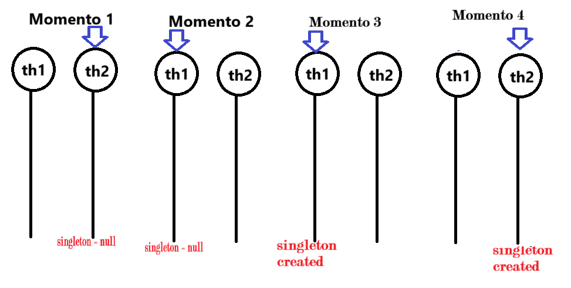

# Taller Patrones de diseño de software ✨👩‍🎤

## Nombre del estudiante
- Camilo Andrés Medina Sánchez
- 🏫 Universidad Nacional De Colombia 🏫
- 💻Ingeniería de sistemas y computación💻

## Fecha de entrega
`2026-05-09`

### Patrones de diseño creacionales

Estos patrones buscan facilitala creación de objetos predefiniendo su lógica y encapsulandola, con el fin de hacer el sistema más flexible y desacoplado. 
Un ejemplo muy general, podria ser en un restaurante cuando se pide un plato y no se conoce el proceso de trás de la **creación del plato** solo se conoce el resultado.

#### Patrón de diseño singleton

El patrón de diseño singleton busca la creación de una clase global y una sola instancia de ella proponienco un punto de acceso global para que esta pueda ser utilizada, este patrón de diseño puede estar muy estrechamente relacionado con el proceso de inyección de dependencias y por tanto, tendrá una relación muy fuerte con el principio de dependency inversion (DIP) de solid.
En esta sección se mostrará la implementación del patrón singleton y a su vez como este puede ser relacionado con el quinto principio solid. 

Un ejemplo de la vida real del patrón singleton es el gobierno de un país, teniendo en cuenta que solo puede existir un gobierno.

Usualmente, este patrón es ampliamente utilizado para definir parámetros de configuración que se deben compartir durante todo el flujo de ejecución, por ejemplo, una conexión a base de datos. Para este ejemplo particular, se va a programar un sistema de logs basado en una lista.

Notese la arquitectura o diseño inicial de la clase singleton, el constructor está privado. Por tanto, no se pueden hacer llamados a la creación de objetos por fuera de la misma clase. Es decir, esto está prohibido: 
```java
LoggerSingleton log1 = new LoggerSingleton();
LoggerSingleton log2 = new LoggerSingleton();
```
Notese que se crea una variable instance dentro de la clase singleton la cual es estática, es decir, se comparte en todas las instancias de la clase (A pesar de que solo se tendrá una).
```java
public static synchronized LoggerSingleton getInstance() {
    if (instance == null) {
        instance = new LoggerSingleton();
    }
    return instance;
}
```
Por otro lado, tengase en cuenta la funcion getInstance, esta es una función crucial.
En primera medida, notese que es una función synchronized, esto teniendo en cuenta que si se hace multithreading en java, mientras se está en un hilo puede ser que la instancia no exista y al pasar a otro se cree la instancia y regresando se cree de nuevo. Resultando con dos instancias (A pesar de que suena confuso).



La imagen describe la situación presentada. 
Comenzando en el segundo hilo se ve que singleton está en null.
Se cambia al hilo 1 y se ve que singleton está en null, entonces, se instancia la clase.
Se cambia de nuevo al hilo 2 y como singleton estaba en null se instancia.
Resultado del proceso, hay dos instancias de la clase singleton.

En terminos generales, la función getInstance, verifica si existe una instancia de la clase, si no hay, la crea. Por el contrario, si ya existe la devuelve. 

La recopilación de estas medidas permiten lo siguiente: 
```java
LoggerSingleton log1 = new LoggerSingleton();
LoggerSingleton log2 = new LoggerSingleton();
System.out.println(log1 == log2); // true
```
Notese que solo es posible la creación de una instancia de clase.

#### Patrón de diseño factory
#### Patrón de diseño builder

#### Patrón de diseño

#### Patrón de diseño 

### Patrones de diseño estructurales

#### 

### Patrones de diseño de comportamiento


### Referencias
- https://refactoring.guru/es/design-patterns/singleton
- https://www.arquitecturajava.com/ejemplo-de-java-singleton-patrones-classloaders/?pdf=5435
- https://lapalejandro.wordpress.com/wp-content/uploads/2010/02/patrones-de-diseno-singleton1.pdf

