# Taller SSH✨👩‍🎤

## Nombre del estudiante
- Camilo Andrés Medina Sánchez
- 🏫 Universidad Nacional De Colombia 🏫
- 💻Ingeniería de sistemas y computación💻

## Fecha de entrega
`2026-05-06`

### NodeJS

NodeJS es un entorno de ejecución de javascript que permite a los desarrolladores la ejecución de código javascript por fuera del navegador,principalmente en el servidor.
Como primera medida en este taller se debe verificar la existencia de la instalación de NODEJS en nuestra máquina, para ello ejecutamos en la terminal de powershell el comando.
```powershell
node --version
```
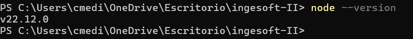

Como se puede evidenciar en la imagen, existe en la maquina una versión de Node activa, razón por la cual es posible continuar con el desarrollo de la práctica.

### Ejecución del servidor

Para continuar se debe ejecutar el servidor de NodeJS, código que ya ha sido previamente implementado, para esto, se debe ubicar dentro del directorio en donde se encuentra el script del server y ejecutar el comando 
```powershell
node server.js
```
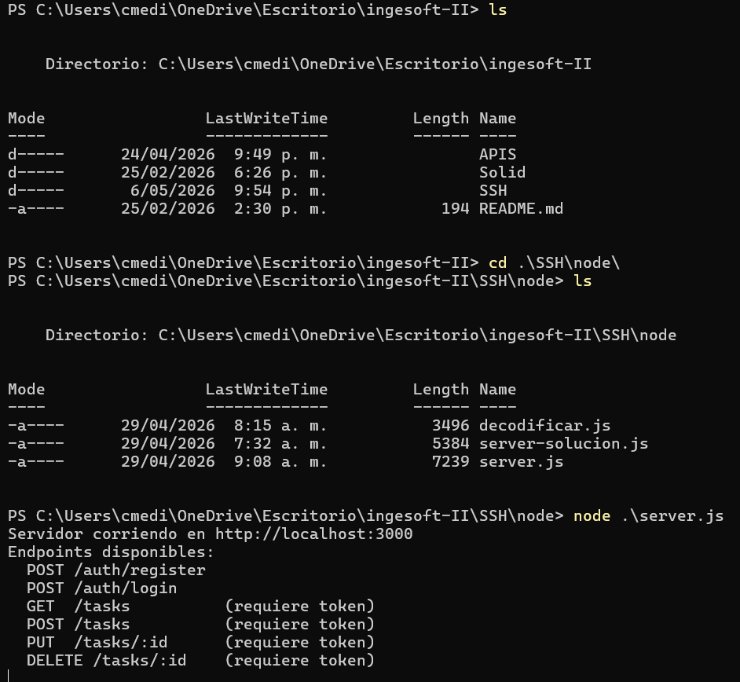

Como se ve en la imagen, se cambia al directorio en donde se encuentran los archivos del servidor y se ejecuta el comando previamente indicado. 

```javascript
server.listen(3000, () => {
  console.log('Servidor corriendo en http://localhost:3000');
  console.log('Endpoints disponibles:');
  console.log('  POST /auth/register');
  console.log('  POST /auth/login');
  console.log('  GET  /tasks          (requiere token)');
  console.log('  POST /tasks          (requiere token)');
  console.log('  PUT  /tasks/:id      (requiere token)');
  console.log('  DELETE /tasks/:id    (requiere token)');
});
```
En las ultimas líneas del script del servidor se indica que se debe sacar por consola la siguiente información de los endpoints que hay disponibles.
Esto se puede confirmar desde la consola luego de ejecutar el script.

### Ejecución de comandos desde otra terminal

#### Register

```powershell
Invoke-RestMethod -Method POST -Uri http://localhost:3000/auth/register -ContentType "application/json" -Body 	'{"username":"ana","email":"ana@test.com","password":"1234"}'

```
Como se puede ver en la solicitud que se está presentando, se busca hacer una solicitud HTTP de tipo Post, en la url localhost en el puerto 3000 (Siendo este en donde se ejecuta el servidor de NodeJS) y se pasa en formato .json los valores de: 
- Nombre de usuario
- Correo electrónico
- 

El código en server para este endpoint es el siguiente
```javascript
// POST /auth/register
if (method === 'POST' && url === '/auth/register') {
    const { username, email, password } = await readBody(req);

    if (!username || !email || !password)
      return send(res, 400, { error: 'Todos los campos son requeridos' });

    const existe = db.users.find(u => u.email === email);
    if (existe)
      return send(res, 409, { error: 'El email ya esta registrado' });

    const user = {
      id: Date.now().toString(),
      username,
      email,
      password
    };
    db.users.push(user);
    return send(res, 201, { message: 'Usuario creado', userId: user.id });
}
```
Como se ve acá, este endpoint tiene que ser tipo post y se establece la url `/auth/register`.
Se indican los parametros que deben ser enviados (Mencionados más arriba), se desarrollan validaciones de si el correo electrónico ya está en la base de datos o si los valores enviados no son suficientes.
Finalmente, se agrega el usuario a la base de datos (que no es una bdd real, solo un objeto que persiste de manera temporal en memoria). Además, la llave primaria de estos registros de usuarios hace referencia a un timestamp convertido en cadena de caracteres.
Si todo el proceso se desarrolla de manera exitosa, se devuelve un código de estado 201. A continuación, se indica con registro fotográfico todo el proceso desarrollado.

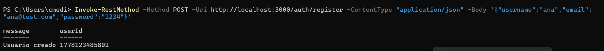

Como se puede ver en la imagen, se desarrolla desde otra consola de powershell la solicitud y se muestra un mensaje del lado del usuario en donde se confirma la creación del usuario.
Ahora bien, permitamonos volver a enviar la solicitud, teniendo en cuenta que el usuario ya existe, para ver el comportamiento del sistema.

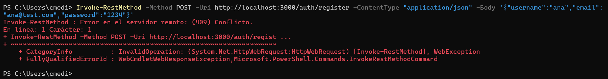
En la imagen se muestra el surgimiento de un error por la ya existencia de los datos de usuario ingresados en la "base de datos".

#### Inicio de sesión - login

Se pretende la ejecución y muestra del proceso de inicio de sesión desarrollando la solicitud http por medio de la consola secundaria que se tiene. Para ello, se ejecuta el siguiente comando en la terminal.

```powershell
Invoke-RestMethod -Method POST -Uri http://localhost:3000/auth/login -ContentType "application/json" -Body '{"email":"ana@test.com","password":"1234"}'
```
Si el inicio de sesión se desarrolla de forma apropiada se devuelve un json web token (JWT) con el fin de utilizarlo en las demás solicitudes.

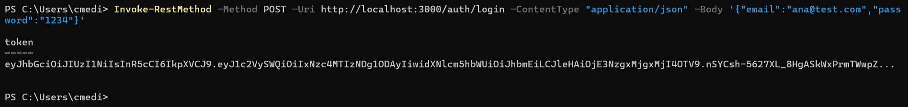

No obstante, si el inicio de sesión es incorrecto, se muestra un error en la consola, como el siguiente.

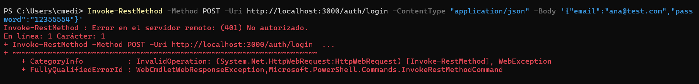

#### Guardado del token como una variable

En esta sección se pretende guardar el token generado, para esto se desarrolla el mismo llamado al enpoint e inicio de sesión, solo que esta vez se indica que el JWT debe ser guardado en la variable $token. Esto de la siguiente manera.

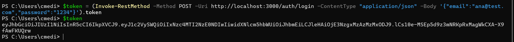

Como se puede evidenciar en la imagen, se muestra el proceso de solicitud del token y la consulta del mismo. 

#### Solicitud de tasks

Como se evidenció anteriormente tasks es un enpoint que está protegido. Por tantop, en el encabezado se debe incluir el bearer token, si este no está incluido, la información no podrá ser consultada. A continuación, se intenta consultar el endpoint sin darle el token y luego se consulta el mismo pasandole el token.

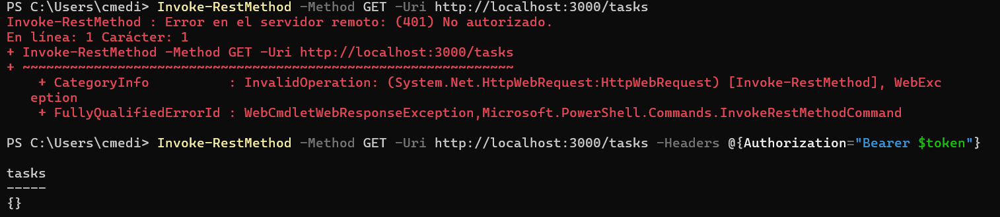

#### Creación de un task

Ahora bien, en el numeral anterior se desarrolló el listado de los tasks o tareas que hay en la "base de datos". No obstante, como no hay ninguno, es necesario, agregar tasks y despues listarlos, la solicitud de agregar se indica a continuación.

```powershell
Invoke-RestMethod -Method POST -Uri http://localhost:3000/tasks -ContentType "application/json" -Headers @{Authorization="Bearer $token"} -Body 	'{"title":"Estudiar JWT","description":"Practicar"}'
```

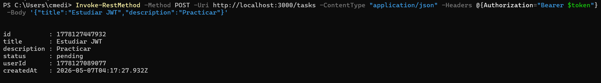

Luego, se proceden a listar las tareas que existen para obtener lo siguiente.

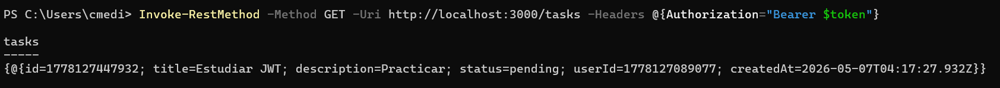

### Sección JWT

En el script de `decodificar.js` hay una serie de preguntas que permiten profundizar un poco acerca de jwt. Para comenzar, planteemos una perspectiva general para después reolver las preguntas.

JWT son las siglas de JSON Web Token, es un formato muy compacto para la representación de información usado para autenticación y autorización entre un cliente y un servidor.

El JWT le dice al servidor, el usuario Pepito Pérez ya inicio sesión y estos son algunos datos que hay sobre el.

De manera usual, el cliente guarda el token en una cookie o en localstorage para enviar en cada una de las olicitudes al servidor.

Un jwt está dividio en tres secciones que están divididas por puntos, estas son: 
- Header (Encabezado).
- Payload (Carga útil).
- Signature (Firma).

Ahora bien, con estos datos bases, se procede a resolver las preguntas.

1. ¿Qué informacion viaja en el Header?

El header de un JWT tiene información sobre qué tipo de token es y cómo fue firmado.

```json
{
    "alg": "HS256",
    "typ": "JWT"
}
```

El encabezado no es secreto. Por tanto, cuanquier persona puede decodificarlo y verlo, este está cifrado en base64

2. ¿Los datos del Payload estan cifrados o solo codificados en Base64?

Por lo general los datos de la carga útil no están cifrados, estos solo están codificados en base 64.

3. ¿Por qué NO se debe guardar la contraseña en el payload?

Como se estableció en el numeral anterior, la carga útil no está cifrada. Por tanto, no es seguro guardar información sensible allí, al solo tener codificación en base 64.

4. ¿Qué pasa si alguien roba el token? Como se mitiga ese riesgo?

Cualquier persona que tenga un token válido puede suplantar la identidad de un usuario, para esto, se implementan algunas verificaciones sencillas pero con una importancia muy alta.
- Uso de expiraciones cortas exp
- Usando conexión cifrada por SSL, https
- Evitar guardar los tokens en locaciones inseguras como localstorage, en cambio, se puede usar una cookie.

5. ¿Qué diferencia hay entre Base64 (codificacion) y AES/RSA (cifrado)?

Base64 es codificación: solo transforma datos, cualquiera puede revertirlo.
AES/RSA son cifrado: protegen datos usando claves; sin la clave correcta no deberían poder leerse.

### Conexión por medio de SSH

Para la practica por medio de SSH se pretende crear una instancia de windows subsystem for linux (WSL), de esta manera se tiene una distro de ubuntu corriendo en windows para el desarrollo de las solicitudes por secure sheel (ssh).

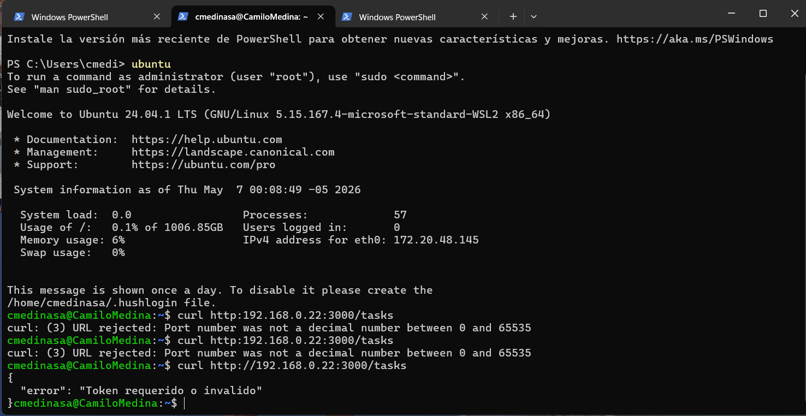

Como se ve en la anterior imagen, se ingresa a WSL por medio de la terminal powershell y se comprueba que está activa la conexión.

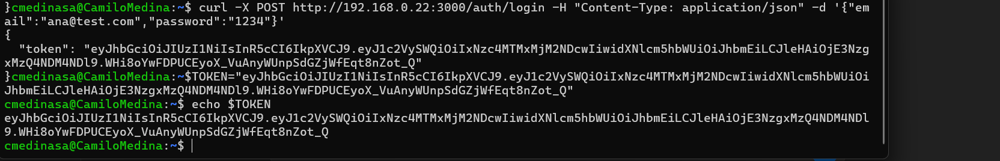

La imagen previa muestra el proceso de inicio de sesióny el guardado del token en una variable, esto con el fin de poder usarlo en futuras solicitudes.

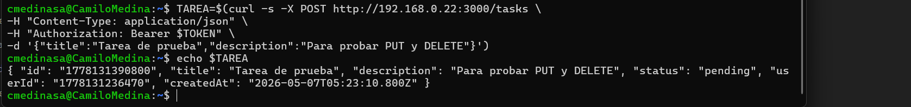

El siguiente paso es la creación de una taream, la cual después va a ser actualizada y eliminada.
Las dos imagenes a continuación muetran el proceso de actualización y eliminación. Además, se muestra el resultado del proceso al listar las tareas

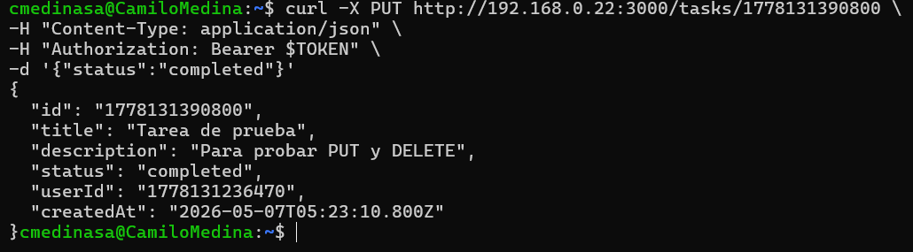
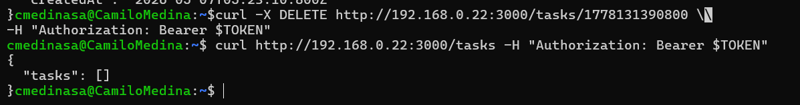
