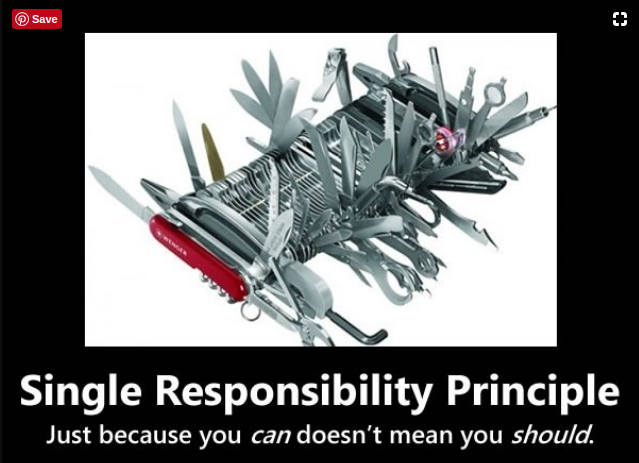
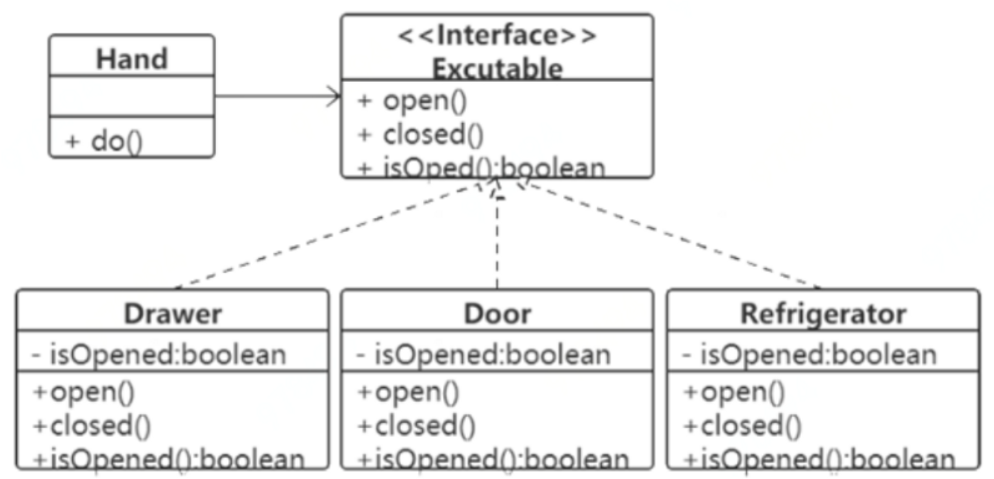
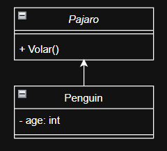
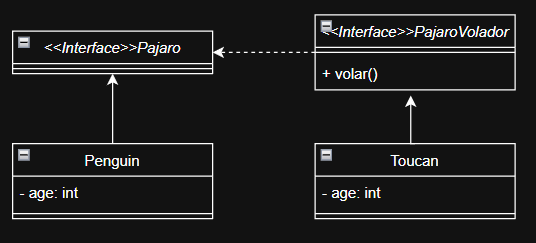

# Taller Principios SOLID ✨👩‍🎤

## Nombre del estudiante
- Camilo Andrés Medina Sánchez
- 🏫 Universidad Nacional De Colombia 🏫
- 💻Ingeniería de sistemas y computación💻

## Fecha de entrega
`2026-02-25`

### Single responsability principle (**S**RP)

En términos generales, se define que el principio de la responsabilidad única indica que

> A class should have one and only one reason to change, meaning that a class should have only one job.

o en español, 

> Una clase debe tener una y solo una razón para cambiar, lo que quiere decir que, una clase sólo debe tener una tarea o trabajo.



En la imagen, se indica lo que **NO** debe hacerse en programación. Al indicar que, a pesar de tener la capacidad de hacer las cosas no es necesario hacerlas todas.

Ahora bien, para ver la implementación desde el lenguaje de programación, vease la siguiente definición de la clase, esta es una abreviación, para ver el código completo dirigase [acá.](./SRP/WrongImplementation/Factura.Java)
```java
class Factura{
    private double[] productos;

    public Factura(double[] productos){
        // ...
    }

    public double calcularTotal(){
        // ...
    }

    public void guardarEnBaseDeDatos(){
        // ...
    }

    public void enviarCorreo() {
        // ...
    }
}

```

En esta clase Factura se ven la definición de varios métodos
- Método constructor
- Método para el cálculo del total
- Método para el guardado en la base de datos
- Método para el envío de notificaciones por correo electrónico

Es decir, la clase factura tiene multiples responsabilidades. Ahora bien, se muestra una implementación de la clase factura de forma correcta.

```java
class Factura {

    private double[] productos;

    public Factura(double[] productos) {
        // ...
    }

    public double calcularTotal() {
        // ...
    }
}
```
El segmento de código mostrado anteriormente muestra una implementación correcta de la clase Factura, en donde se define un constructor que recibe un arreglo con los productos y una función que calcula el total del valor. El código completo de la implementación se encuentra [acá.](./SRP/CorrectImplementation/Factura.java)
```java
class FacturaRepository {
    public Connection conectar(){
        // ...
    }

    public void close(Coneection conexion) throws SQLException{
        // ...
    }

    public void guardar(Factura factura) {
        // ...
    }
}
```
El segmento de código anterior indica el proceso de persistencia en la base de datos, el código completo se encuentra [acá.](./SRP/CorrectImplementation/FacturaRepository.java)
```java
class EmailService {

    public void enviarFactura(Factura factura) {
        // ...
    }
}
```
El bloque de código previo indica el proceso de envío de facturas haciendo uso de un servicio de correo electrónico, el código completo referenciado se encuentra [acá.](./SRP/CorrectImplementation/EmailService.java)
```java
public class Main {
    public static void main(String[] args) {

        Factura factura = new Factura(new double[]{100, 200, 300});

        FacturaRepository repository = new FacturaRepository();
        EmailService emailService = new EmailService();

        double total = factura.calcularTotal();
        System.out.println("Total: " + total);

        repository.guardar(factura);
        emailService.enviarFactura(factura);
    }
}
```
Finalmente, el método principal que permite el desarrollo de las funcionalidades asociadas al desarrollo de la factura.

De esta forma se puede ver como se segmenta una clase que tenia muchas tareas en cuatro clases distintas en donde cada una tiene una tarea puntual. A continuación se listan las ventajas que existen cuando una división apropiada de responsabilidades 

- **Mayor mantenibilidad**: El código es más fácil de entender, los cambios son más localizados y se reduce el riesgo de romper otras funcionalidades al desarrollar cambios.
- **Mejor testeo**: Como las clases son más pequeñas y enfocadas, son más fáciles de probar con pruebas unitarias más fáciles.
- **Código más limpio y organizado**: El sistema está estructurado por responsabilidades, de modo que se tiene una cohesión y un orden apropiado.


### Open Closed principle (**O**CP)

En términos generales, se define que el principio de abierto abierto-cerrado indica que

> A module should be opened for extension but closed for modification

o en español, 

> Un módulo debe estar abierto para extensión pero cerrado para modificación.



La imagen anterior permite ver como hay una interfaz que define los métodos que pueden existir y que hay tres clases que *implementan* la interfaz, siendo estas:
- Drawer (Cajón)
- Door (Puerta)
- Refrigerator (Refrigerador)

Notese que en la notación UML (Unified Modeling language) se establece que la interfaz no se hereda. En cambio, una interfaz debe ser implementada.
Ahora bien, una interfaz se puede entender como un contrato, ya que: 
1. Establece "Derechos y obligaciones":
Todos los métodos de una interfaz deben ser implementados, para el caso particular de la imagen, las clases Drawer, Door y Refrigerator no van a poder ser compiladas hasta que todos los métodos sean implementados. 
2. Separa el qué del cómo
En estos casos, se indica que el objeto biens ea una puerta un cajón o un refrigerador deben poderse abrir, cerrar y verificar si la puerta está abierta o cerrada, la interfaz indica la obligación de esto. No obstante, no indica la forma en que estas acciones deben ser desarrolladas. 
3. Generación de estándares
Las interfaces permiten generar acuerdos de estandarización con el fin de mantener ciertos principios o estándares en el sistema. 

Ahora bien, una nota importante acerca de un atributo que comparte cada una de las clases que son implementadas a partir de la interfaz. Notese, que todas estas tienen un atributo privado de tipo de dato booleano, que indica si la puerta está abierta o cerrada. Además, como en la definición uml está definido con un '-'. Entonces, ese atributo es privado y no se puede acceder a el haciendo uso de la notación estándar punto(.) y debe ser accedido por medio de un getter.

Notese también que el principio OCP es también una puerta de acceso al desarrollo del polimorfismo, uno de los pilares fundamentales de la programación orientada a objetos.

Para continuar, se debe analizar las implementaciones apropiadas y otras no tan apropiadas del OCP. 
Principalmente se debe definir la [interfaz](./OCP/CorrectImplementation/Executable.java) que tiene los métodos que deben ser implementados

```java
public interface Executable {
    void open();
    void close();
    boolean getOpenned();
}
```
Para continuar se definen cada una de las clases que implementan la interfaz. 
[Implementación para la clase Door](./OCP/CorrectImplementation/Door.java)
```java
public class Door implements Executable {

    private boolean isOpened;

    public Door(boolean opened){
        this.isOpened = opened;
    }

    @Override
    public void open() {
        // ...
    }

    @Override
    public void close() {
        // ...
    }

    @Override
    public boolean getOpenned(){return isOpened;}
}
```
[Implementación para la clase Drawer](./OCP/CorrectImplementation/Drawer.java)
```java
public class Drawer implements Executable{
    private boolean isOpened;

    public Drawer(boolean opened){
        this.isOpened = opened;
    }

    @Override
    public void open(){
        // ...
    }

    @Override
    public void close(){
        // ...
    }

    @Override
    public boolean getOpenned(){return isOpened;}
}

```
[Implementación para la clase Refrigerator](./OCP/CorrectImplementation/Refrigerator.java)
```java
public class Refrigerator implements Executable {

    private boolean isOpened;

    public Refrigerator(boolean opened){
        this.isOpened = opened;
    }

    @Override
    public void open() {
        // ...
    }

    @Override
    public void close() {
        // ...
    }

    @Override
    public boolean getOpenned() {return isOpened;}
}
```
Notese que todos los métodos tienen el decorador @Override, lo que indica que el método se está sobreescribiendo.
Ahora bien, veamos la implementación de la clase Hand y el cambio que está tiene cuando no se usa una interfaz. 
[*Clase hand cuando hay una interfaz*](./OCP/CorrectImplementation/Hand.java)
```java
public class Hand {

    public void doAction(Executable executable) {

        if (!executable.getOpenned()) {
            executable.open();
        } else {
            executable.close();
        }
    }
}
```
[*Clase hand cuando no hay una interfaz*](./OCP/WrongImplementation/Hand.java)
```java
public class Hand {

    public void doAction(Door door) {
        if (!door.getOpenned()) {
            door.open();
        } else {
            door.close();
        }
    }

    public void doAction(Drawer drawer) {
        if (!drawer.getOpenned()) {
            drawer.open();
        } else {
            drawer.close();
        }
    }

    public void doAction(Refrigerator refrigerator) {
        if (!refrigerator.getOpenned()) {
            refrigerator.open();
        } else {
            refrigerator.close();
        }
    }
}
```

El anterior cambio se debe a que no hay un "contrato" o estándar de cómo se van a desarrollar el llamado de los métodos. Notese que como argumento la primera definición de la clase recibe una instancia de executable(la interfaz). Mientras que para el segundo bloque se recibe una implementación de la interfaz (Que para este caso es una abstracción, pues la interfaz no existe). 

La principal diferencia entre estos bloques es que para el segundo no hay un estándar predefinido que permita de forma fácil acceder a los métods que estas tres clases (Door, Drawer, Refrigerator) deben tener.


### Liskov substitution principle (**L**SP)

|  Barbara Liskov o Barbara Jane Liskov, es una prominente científica de la computación estadounidense.Sus mayores contribuciones incluyen el Principio de Sustitución de Liskov (LSP), la creación del lenguaje CLU (abstracción de datos) y el desarrollo del lenguaje distribuido Argus. |  |
| ---------------------------------------------------------------------------------------------------- | -------- |

En términos generales, se define que el principio de sustitució de liskov indica que

> Objects of a superclass should be replaceable with objects of its subclasses without breaking the application or altering expected behavior.

o en español, 
> Objetos de una superclase deben poder ser reemplazados por objetos sus subclases sin romper la aplicación o alterar el comportamiento esperado.

En principio, el principio de sustitución de Liskov puede ser un poco confuso, es por ello que se va a desglosar de manera sencilla a continuación. Para esto, se van a plantear dos ejemplos, el primero de forma conceptual y didáctica y el segundo a modo de aplicación más elaborada.

Para el primer ejemplo veamos el siguiente diagrama de clases UML.

Como se puede ver, existe una super clase llamada Pajaro con el método de clase público volar y hay una clase pinguino que herada de Pajaro, es decir, todos los métodos de Pajaro quedan en Penguin y a su vez un atributo privado que indica la edad del ave.
Veamos, el siguiente bloque de código: 
```java
public void makeBirdFly(Bird bird){
    bird.fly();
}
makeBirdFly(new Penguin());
```
En este caso, se espera un pájaro que tenga la capacidad de volar. No obstante, el pingüino no tiene la capacidad de volar. Lo cual, indica una error del sistema.
Ahora bien, desde la definición técnica del LSP, se indica que la subclase debe estar en la capacidad de reemplazar la clase padre. En este caso, es evidente que debido al método Volar(), es imposible que una instancia de la clase Penguin esté en la capacidad de sustituir a su padre Pajaro.

Ahora bien, veamos la implementación apropiada del principio de sustitución de liskov desarrollandoi la corrección de lo presentado previamente.

Notese que hay una interfaz Pajaro y una interfaz PajaroVolador. La segunda implementa la primera. No obstante, esto no es de relevancia importante para el análisi. Notese que Penguin implementa Pajaro, lo cual es apropiado pues no existe el método volar. Por otro lado, Toucan, implementa PajaroVolador, lo cual es apropiado pues se puede hacer uso del método volar.

Para el segundo ejemplo. 

Se define una clase [rectángulo](./LSP/WrongImplementation/Rectangle.java) la cuál es bastante sencilla con dos setters y un getter que devuelve el valor del área.

```java
class Rectangle {

    protected int width;
    protected int height;

    public void setWidth(int width) {this.width = width;}

    public void setHeight(int height) {this.height = height;}

    public int getArea() {return width * height;}
}
```
A su vez se declara una clase Square que hereda de Rectangle, algo que es notoriamente erroneo. No obstante, por el ejemplo se desarrollará el proceso de herencia.

```java
class Square extends Rectangle {
    @Override
    public void setWidth(int width) {
        this.width = width;
        this.height = width; // fuerza lados iguales
    }

    @Override
    public void setHeight(int height) {
        this.height = height;
        this.width = height; // fuerza lados iguales
    }
}
```

La principal incidencia que se ve acá es el mal uso de los setters al intentar forzar que el rectangle tenga unas medidas igual en su base y su alto. Lo cual puede terminar en que la figura original sufra deformaciones. Ahora bien, la forma correcta de desarrollarla es la siguiente.

Definición de [una interfaz sencilla shape](./LSP/CorrectImplementation/Shape.java)
```java
interface Shape {
    int getArea();
}
```

Una clase [rectángulo](./LSP/CorrectImplementation/Rectangle.java) la cual implementa esta interfaz de modo que el constructor recibe los parámetros de base y altura, guardandolos como atributos privados y el método getArea() devuelve el área del rectángulo.

Finalmente, para el [cuádrado](./LSP/CorrectImplementation/Square.java) se tiene un constructor que solo recibe la longitud de una de estas aristas y el método getArea() que se debe implementar de forma obligatoriua por lo definido en la interfaz y que eleva al cuadrado este atributo privado.

De esta forma se tiene un principio de sustitución de liskov apropiado y un código con alta coherencia.

### Interface Segregation principle (**I**SP)

En términos generales, se define que el principio de segregación de interfaces indica que

> Clients should not be forced to depend on methods they do not use.

o en español, 

> Los clientes no deben ser forzados a depender en métodos que no usan

Esto indica que no se deben crear interfaces que sean muy grandes o robustas con todos los métodos dentro de ellas. En cambio, se deben crear varias interfaces que permitan tener los difrentes métodos condensados en ellas sin tener un solo monolito de interfaz. 

Para el ejemplo del código, comencemos con la creación de una [interfaz trabajador](./ISP/WrongImplementation/Worker.java)
```java
public interface Worker {
    public void work();
    public void eat();
}
```
Se van a crear dos tipos de trabajadores a partir de la interfaz trabajador (Worker), las cuales serán: 
- Trabajador humano
- Trabajador robot

[Clase trabajador humano](./ISP/WrongImplementation/HumanWorker.java)
```java
public class HumanWorker implements Worker {
    @Override
    public void work(){}
    
    @Override
    public void eat(){}
}
```
[Clase trabajador robot](./ISP/WrongImplementation/HumanWorker.java)
```java
public class RobotWorker implements Worker {
    @Override
    public void work(){}
    
    @Override
    public void eat(){}
}
```
En la segunda clase, en donde se define el trabajador robot, se encuentra un importante error puesto que el robot no debe estar en la capacidad de comer.

La solución de esto es muy sencilla, por lo cual no se codifica solo se explica. Para arreglar este desperfecto de abstracción, se deben crear dos interfaces 
```java
public interface Workable(){
    public void work();
}
```
```java
public interface Eatable(){
    public void eat();
}
```
De esta forma cada uno de los tipos de trabajadores implementa los métodos necesarios para su funcionamiento adecuado.
HumanWorker, implementa tanto eatable como Workable. Mientras que, RobotWorker implementa solo Workable.

### Dependency inversion principle (**D**IP)

En forma general, 
> Los módulos de alto nivel no deben depender de módulos de bajo nivel; ambos deben depender de abstracciones.
Las abstracciones no deben depender de los detalles; los detalles deben depender de las abstracciones.

De forma general, las características generales del DIP son 

- La lógica de negocio no conoce detalles técnicos específicos.
- Las implementaciones concretas (por ejemplo, MySQL, envío de email, APIs externas) se conectan mediante interfaces.
- Si cambia una tecnología, no es necesario modificar la lógica principal del sistema.

Principalmente, la tercera premisa da lugar al proceso de inyección de dependencias.
En la inyección de dependencias, los modulos que necesite la clase para su funcionamiento, no son creados de forma interna. En cambio, se pasan a la función como argumento, es decir, son instanciados en otro lugar y se inyectan a la clase por medio del constructor u otro método relevante.

```java
class Television {

    public void turnOn() {
        System.out.println("Television ON");
    }
}

class RemoteControl {

    private Television tv = new Television();

    public void pressButton() {
        tv.turnOn();
    }
}
```
En el segmento anterior se identifica que la clase de control remoto depende estrictamente de la clase Televisión, pues dentro de ella se instancia un objeto de tipo Televisor.
Esto genera problemas, porque, si de forma general se pretende tener un control remoto para otro dispositivo que no sea un televisor, sino por ejemplo, un radio o dispositivo de reproducción de sonido, la clase deberia ser modificada desde su contenido interno.
Es por ello que, para cumplir el DIP se pueden aplicar los siguientes cambios
```java
interface Device {
    void turnOn();
}
```
```java
class Television implements Device {

    public void turnOn() {
        System.out.println("Television ON");
    }
}
```
```java
class Radio implements Device {

    public void turnOn() {
        System.out.println("Radio ON");
    }
}
```
Ahora, la implementación de control remoto queda de la siguiente forma:
```java
class RemoteControl {

    private Device device;

    public RemoteControl(Device device) { // inyección por constructor
        this.device = device;
    }

    public void pressButton() {
        device.turnOn();
    }
}
```
Como se logra ver, se permite un uso general del control remoto y para implementar otro dispositivo no se deben modificar las clases originales ya descritas.

### Referencias
- https://corecppil.github.io/Meetups/2020-05-26_CoreCpp_Worldwide!/The_SOLID_Principles.pdf
- https://ivanderevianko.com/wp-content/uploads/2013/10/Agile-Principles-Patterns-and-Practices-in-C.pdf : Chapter 8 - Chapter 12
- https://www.digitalocean.com/community/conceptual-articles/s-o-l-i-d-the-first-five-principles-of-object-oriented-design#single-responsibility-principle
- https://www.geeksforgeeks.org/system-design/solid-principle-in-programming-understand-with-real-life-examples/